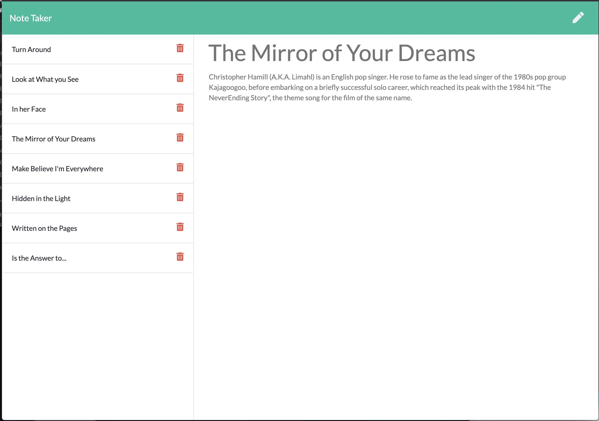
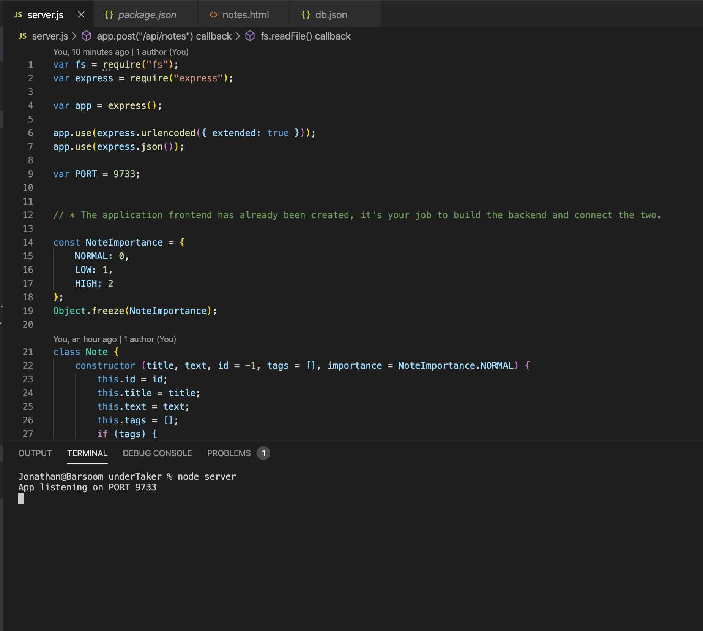

# underTaker - Unit 11 Express Homework: Note Taker
[](https://opensource.org/licenses/MIT)

> Notes Can Too Be Fun!

A note taker app using a JSON database sounds pretty basic, but the exercise was really one in getting the server to respond to data and API requests, and that was interesting. This front-end was provided by the course, so it's nothing special. Personally, I'd have loved to integrate importance flags, note tags with full search and sort capability, and text formatting. Maybe next time. Maybe in SQL...

## User Story

```
AS A User with Memory Problems that RAM won't fix
I WANT a Note Program of my own making
SO THAT I can twiddle the things I don't like about it
```

```
GIVEN THAT I visit the web page
WHEN I close the browser and return
THEN I want my notes to persist
WHEN I save a new note
THEN I want it to be added to the list
WHEN I delete a note
THEN I want it to be removed from the DB file
```

## Graphic


## Table of Contents
* [Technologies](#Technologies)
* [Getting Started](#Getting)
* [Usage](#Usage)
* [Questions](#Additional)
* [License](#License)

## Technologies
node.js\
express

## Getting Started
```
npm install
```
express() is the only dependency in this package, so installation is pretty straightforward.


## Usage
```
node server

> App listening on PORT 9733
```

Starting the server on localhost is as simple as running server.js.


After that, you can hit the page at port 9733.

```
> TYPE:
localhost:9733
>  in your preferred web browser.
```


## Additional Questions
Hit me up on email or DM me with questions.

## License
This project is licensed under the The MIT License.


  
### ionathas78

This file generated on 4/17/2020 by goodReadMeGenerator, copyright 2020 Jonathan Andrews
